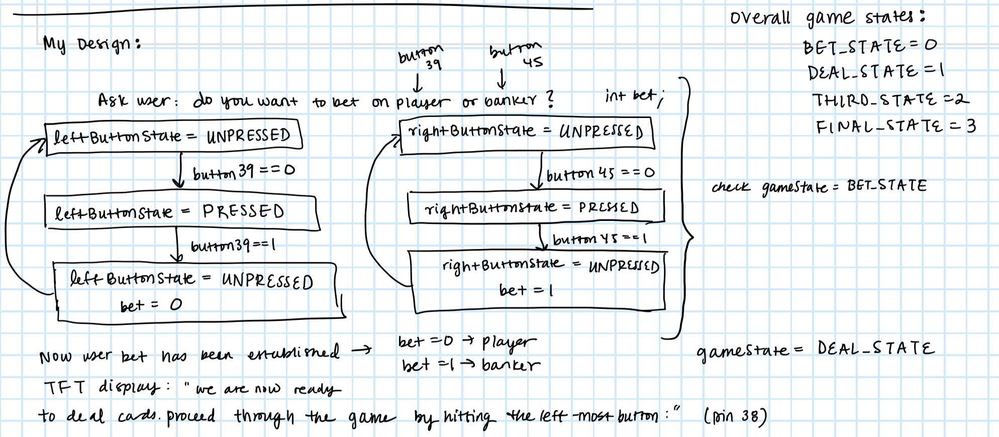
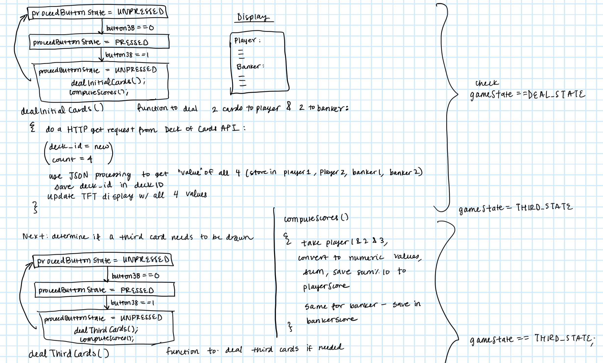
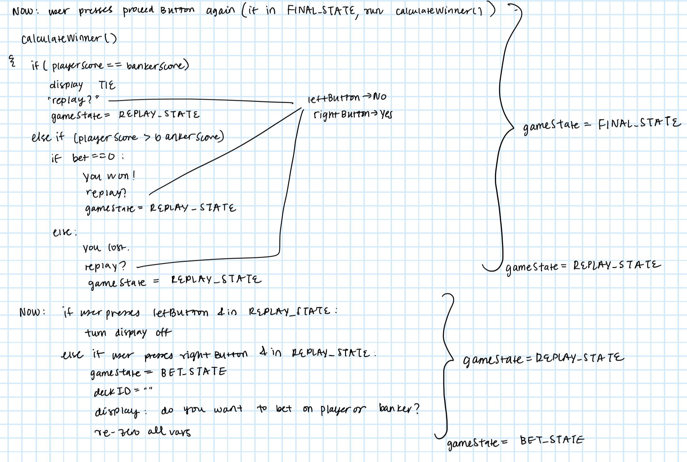

# Overview

For my design exercise, I implemented a version of Baccarat involving a banker and player. I began by defining five overall game states. These states determine what portion of the game is currently being played and are enumerated below:

- BET_STATE: Initial stage of the game where user is placing their bet on the player or banker
- DEAL_STATE: The stage where 2 cards are dealt to both the player and banker
- THIRD_STATE: The part of the game where the system must determine whether a third card is dealt to the banker and/or player based on the rules of Baccarat
- FINAL_STATE: At this stage, the final score of the player and banker is compared to determine the winner, and the user's outcome is determine based on their initial bet
- REPLAY_STATE: Final stage where the system reconfigures based on whether or not the user wants to replay the game

Based on which of these overarching states the game is in, the buttons have different functionality. After conceptualizing these overall states, I began drafting a plan using FSM diagrams as shown below:



These FSM diagrams show that if gameState==BET_STATE, a click of the center button (controlled by leftButtonState) sets the user's bet to player. A click of the bottom button (controlled by rightButtonState) sets of the user's bet to banker.

Once initial instructions and this betting mechanism are displayed to the user on the TFT display, we proceed with game play. I decided to implement a third button to allow the user to proceed through game play with each click. When this button is first clicked, the dealInitialCards() function is called.

```cpp
  void dealInitialCards() {
    int i = 0; //start at 0
    do {
        request_buffer[i] = ("GET http://deckofcardsapi.com/api/deck/new/draw/?count=4 HTTP/1.1\r\n")[i];
    } while(request_buffer[i++]); //continue the loop until the last char is null
    strcat(request_buffer,"Host: deckofcardsapi.com\r\n");
    strcat(request_buffer,"\r\n");
    do_http_GET("deckofcardsapi.com", request_buffer, response_buffer, OUT_BUFFER_SIZE, RESPONSE_TIMEOUT, true);

    StaticJsonDocument<800> doc;

    char* start;
    char* end;
    end = strrchr(response_buffer, '}');
    *(end+1) = '\0';
    start = strchr(response_buffer, '{');

    DeserializationError error = deserializeJson(doc, start);
    ...
    //function cut here for clarity
     
  }
```
The dealInitialCards() function begins by doing an HTTP GET request to the Cards API. In this GET request, we set "deck_id" to "new" because this is the first time we are dealing cards. We also set "count" to 4 in order to get 2 cards for the player and 2 for the banker. These results are then parsed using JSON deserialization, and the appropriate fields are stored in previously initialized char arrays. Along with the identity of each of the cards retrieved, the deckID is also stored in order to retrieve from the same deck in future GET requests.

Next, these cards are used to compute numeric score for the player and banker in the computeScores() function.

```cpp
  void computeScores() {
    
    if (strcmp("ACE", player1) == 0) {
      player1Score = 1;
    }
    else {
      player1Score = atoi(player1);
      //works because atoi returns 0 for any other non numeric and face cards have a value of 0
    }

    if (strcmp("ACE", player2) == 0) {
      player2Score = 1;
    }
    else {
      player2Score = atoi(player2);
    
    }
    ...
    //function abridged here for clarity
    ...

    playerTotalScore = (player1Score+player2Score+player3Score)%10;
    bankerTotalScore = (banker1Score+banker2Score+banker3Score)%10;

  }

```

This function takes the char arrays containing the value of each dealt card, converts them into numeric values based on the rules of Baccarat, and computes total scores for both the player and banker. Once these scores are computed, the dealThirdCards() function is called to determine whether a third card is needed for either the player or banker. If needed, additional HTTP GET requests are performed using the same deckID to ensure that the same deck of cards is used. computeScore() is then run again to update playerTotalScore and bankerTotalScore.

We are now reaching the final stages of my methodology. Since we have final scores for the player and banker, we can determine who has the higher score (winner) and compare that with the user's initial bet. This occurs in the calculateWinner() function:

```cpp
  void calculateWinner() {
    if (playerTotalScore==bankerTotalScore) {
      tft.fillScreen(TFT_BLACK);
      tft.setCursor(0,0,2);
      tft.println("We have a tie!");
      tft.println("Press the bottom button to replay");
      tft.println("Press the center button to turn off");
    }
    else if (playerTotalScore>bankerTotalScore) {
      if (bet==0) {
        tft.fillScreen(TFT_BLACK);
        tft.setCursor(0,0,2);
        tft.println("You won!");
        tft.println("Press the bottom button to replay");
        tft.println("Press the center button to turn off");
        gameState = REPLAY_STATE;
      }
      ...
     //function cut here for clarity
      
    }
}

```
Finally, the user can choose to replay the game. If they choose to replay, all of the relevant variables are reset, largely using the memset() function. My planning notes for the middle and end stages of my project are shown below.





A link to my demonstration video is given here:

[demonstration video](https://youtu.be/F0Vnhckv6T4)


# Summary

Overall, my implementation of Baccarat meets the outlined specifications:

- Use of Cards API - DONE with HTTP requests
- Single-player implementation involving a player and banker
- Memory of deck in use through storage of deckID
- Betting mechanic integrated and repeatedly playable
- Three buttons (pins 45, 39, and 38)
- No use of outside libraries

In addition, I applied JSON deserialization to extract relevant information from the HTTP request response. These technical elements come together to create a robust card game with an appealing UX and intuitive structure. Thank you for taking a look at my project!
